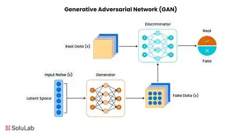
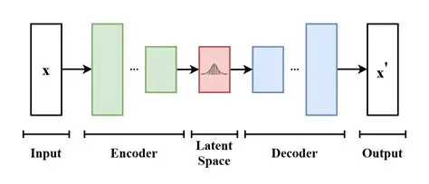
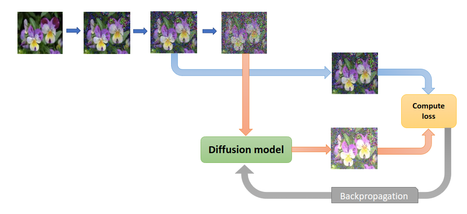

# L'IA qui imagine — Generative AI en Computer Vision

*Par Fatima Zahra Akeznanay — Avril 2026*  
*Cours : Computer Vision, S8*

---

Ce semestre, j’ai étudié plusieurs modèles comme les CNN et les transformers, qui permettent aux machines de voir et de comprendre les images. Mais il existe une autre approche encore plus intéressante : des modèles capables de générer des images.

Il ne s’agit pas simplement de reconnaître ce qui existe, mais de créer quelque chose de totalement nouveau. Des visages de personnes qui n’existent pas, des paysages imaginaires, ou encore des scènes réalistes à partir d’une simple description.

C’est ce qu’on appelle le Generative AI en Computer Vision. Dans ce blog, je vais essayer d'expliquer ce concept de manière simple et claire.

---

## Table des matières

1. C’est quoi exactement ?
2. Pourquoi c’est utile ?
3. Les 3 grandes familles
   - GAN
   - VAE
   - Diffusion Models
4. Comparaison
5. Conclusion

---

## C’est quoi exactement ?

Le principe est assez simple à comprendre.

Lorsqu’on expose une machine à un grand nombre d’images, elle apprend progressivement les caractéristiques importantes : les formes, les textures, les couleurs, et les structures. Une fois cet apprentissage effectué, elle devient capable de générer de nouvelles images qui respectent ces caractéristiques.

Contrairement à un simple copier-coller, le modèle produit du contenu original.

Par exemple :

- Générer une image à partir d’une description textuelle  
- Créer des visages humains réalistes inexistants  
- Transformer une image en un autre style artistique  

---

## Pourquoi c’est utile ?

Au début, cela peut sembler purement esthétique, mais les applications sont nombreuses et concrètes.

Dans le domaine médical, certaines maladies sont rares, ce qui rend les datasets limités. La génération d’images permet d’augmenter ces données et d’améliorer les performances des modèles de détection.

Pour les voitures autonomes, il est impossible de reproduire tous les scénarios dangereux dans la réalité. Les environnements simulés permettent d’entraîner les modèles dans des conditions variées sans risque.

Dans le domaine de la vie privée, il est possible de remplacer des données sensibles, comme des visages réels, par des données synthétiques tout en conservant leur utilité.

Enfin, dans les domaines créatifs comme le design ou le cinéma, ces outils offrent de nouvelles possibilités d’exploration.

---

## Les 3 grandes familles

### GAN — Generative Adversarial Network

Le GAN repose sur un principe d’opposition entre deux réseaux de neurones.

Le premier, appelé générateur, crée des images à partir de bruit aléatoire. Le second, appelé discriminateur, essaie de distinguer les vraies images des images générées.

Le générateur s’améliore progressivement pour tromper le discriminateur, tandis que le discriminateur devient de plus en plus performant. Ce processus continue jusqu’à ce que les images générées deviennent très réalistes.

Les GAN produisent des résultats impressionnants, notamment pour les visages humains. Cependant, leur entraînement est instable et difficile à maîtriser. Un problème courant est le mode collapse, où le modèle génère toujours des images similaires.

#### Schéma de fonctionnement

Bruit aléatoire → Générateur → Image générée  
Image réelle + image générée → Discriminateur → Décision : vrai ou faux  

---

### VAE — Variational Autoencoder

Le VAE fonctionne différemment.

Il encode une image en une représentation compacte appelée espace latent, puis reconstruit une image à partir de cette représentation.

Ce processus permet de comprendre la structure des données et de générer de nouvelles images en modifiant légèrement les variables dans cet espace latent.

L’avantage principal du VAE est sa stabilité et la possibilité de contrôler les caractéristiques des images générées.

Cependant, les résultats sont souvent moins nets et légèrement flous.

#### Schéma de fonctionnement

Image → Encodeur → Vecteur latent (z) → Décodeur → Image reconstruite  

---

### Diffusion Models

Les modèles de diffusion reposent sur un processus en deux étapes.

Dans un premier temps, on ajoute progressivement du bruit à une image jusqu’à obtenir un signal complètement aléatoire. Ensuite, le modèle apprend à inverser ce processus, c’est-à-dire à supprimer le bruit étape par étape pour reconstruire une image.

Une fois entraîné, le modèle peut partir d’un bruit aléatoire et générer une image cohérente.

Ces modèles offrent aujourd’hui les meilleures performances en termes de qualité et de réalisme. En revanche, ils sont plus lents et nécessitent des ressources importantes.

#### Processus de génération

  

---

## Comparaison

| Modèle | Idée | Avantages | Limites |
|--------|------|----------|---------|
| GAN | Compétition entre deux réseaux | Images réalistes, rapide | Instable |
| VAE | Compression + reconstruction | Stable, contrôlable | Images floues |
| Diffusion | Ajout puis suppression de bruit | Très haute qualité | Lent |

---

## Conclusion

Avant d’étudier ces modèles, je voyais l’intelligence artificielle principalement comme un outil d’analyse, capable de reconnaître et classifier des données.

Avec le Generative AI, j’ai découvert une autre dimension : la capacité de création.

Ces modèles ne se contentent plus d’interpréter le monde, ils sont capables de produire du contenu nouveau. Ce changement de perspective est particulièrement intéressant.

Chaque approche propose une vision différente de la génération :

- Les GAN reposent sur la compétition  
- Les VAE sur la compression  
- Les modèles de diffusion sur la reconstruction  

Cela montre qu’il existe plusieurs façons d’aborder un même problème en intelligence artificielle.

---

*Rédigé dans le cadre du cours Computer Vision & Generative AI — S8, Avril 2026.*  
*Sources : cours et articles scientifiques sur GAN, VAE et Diffusion Models.*
